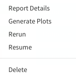

***************
NGS Plots Guide
***************

This guide will walk you through all of your options within the Plots page.

Getting Started
===============

First, make sure to have an instance of dolphin available (see Dolphin Docker) as well as an account for the dolphin interface.

Once logged in, click on the 'NGS Tracking' tab on the left, then click on 'Run Status'.

.. image:: dolphin_pics/menu_bar.png
	:align: center
	
After navigating to the status page, the next step is to make sure the run whose results you are interested in has completed without errors.

Once you have a completed run, you can select the options button on the far right and select the 'Generate Plots' option.

	
Selection this option will bring you to the Plots page.

Alternatively, You can visit the Reports page for the run and click on the 'Go To Plots' button at the bottom of the page to go to the plots page.

Plots Navigation
================

