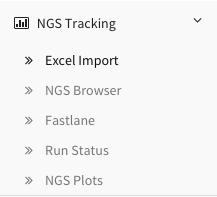

*****************
NGS Reports Guide
*****************

This guide will walk you through all of your options within the Reports page.

Getting Started
===============

First, make sure to have an instance of dolphin available (see Dolphin Docker) as well as an account for the dolphin interface.

Once logged in, click on the 'NGS Tracking' tab on the left, then click on 'Run Status'.

	
After navigating to the status page, the next step is to make sure the run whose results you are interested in has completed without errors.

Once you have a completed run, you can select the options button on the far right and select the 'Report Details' option.

